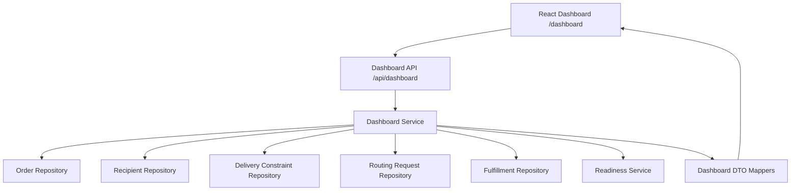

# Sender & Operations Dashboard Specification (Phase 9)

## 1. Architectural Overview

Phase 9 introduces the central **Visibility and Operational Monitoring Layer** for ClaimRoute. It unites data across the entire delivery lifecycle into a responsive dashboard for Senders and Operations personnel without duplicating backend state machines in the frontend.

---

## 2. Authorization & Least-Privilege Model

Dashboard access strictly enforces server-side role boundaries using `authorizationService.js`. The frontend simply reflects backend authorizations.

| Role           | Scope                    | Recipient Phone               | Order Access                                                    |
| :------------- | :----------------------- | :---------------------------- | :-------------------------------------------------------------- |
| **SENDER**     | Sender-owned orders only | **Masked** (`+91 ••••••1234`) | Restricted to orders matching caller's authenticated `senderId` |
| **OPERATIONS** | Tenant-wide              | **Unmasked**                  | Operational access across all active and completed deliveries   |
| **ADMIN**      | Tenant-wide              | **Unmasked**                  | Full operational access across all tenant records               |

> [!CAUTION]
> Public unauthenticated claim links and recipient users are strictly denied access to all `/api/dashboard/*` endpoints.

---

## 3. Dashboard Metrics & Data Aggregation

### 3.1 Aggregated Counts (`GET /api/dashboard/summary`)

Summary counts are dynamically computed from live backend Firestore state without creating conflicting read models:

- **Total Deliveries**: Total number of orders accessible to the user
- **Created**: Unclaimed orders in initial draft state
- **Awaiting Claim**: Orders with active one-time claim tokens
- **Claimed**: Orders successfully claimed by recipients
- **In Processing**: Orders under operational review and address validation
- **Routing Ready**: Orders with verified addresses and active routing plans
- **Fulfillment Ready**: Orders staged for final delivery dispatch
- **Completed**: Successfully fulfilled orders
- **Cancelled**: Terminated orders preserved in history

### 3.2 Action-Required Attention Triggers

The dashboard proactively highlights operational bottlenecks:

1. `aiExtractionFailed`: Active deliveries whose unstructured notes failed AI parsing.
2. `routingBlocked`: Deliveries in `PROCESSING` status missing required address fields.
3. `recipientDetailsPending`: Orders awaiting recipient address entry.

---

## 4. Operational DTOs & Sensitive Data Protection

Dashboard APIs strictly return sanitized DTOs (`mapDashboardOrderDTO`, `mapDashboardOrderDetailResponse`) and never return raw Firestore document models.

### Protections Enforced:

1. **Zero Token Exposure**: Raw claim tokens and SHA-256 token hashes are **never** returned in list or summary DTOs.
2. **Phone Number Masking**: Recipient phone numbers are masked for senders (`+91 ••••••3210`) to safeguard PII while confirming delivery contactability.
3. **No Unrestricted Full-Text Scans**: Queries are bounded by indexed sender IDs, pagination limits (max 100 per request), and cursor markers.
4. **No Client-Side Token Storage**: Sensitive operational data is never stored in `localStorage`, `sessionStorage`, or URL query parameters.

---

## 5. API Reference

All dashboard endpoints require authentication via Bearer token or development identity headers (`X-Sender-Id`, `X-User-Role`):

| Method | Endpoint                         | Query Parameters                                                                        | Description                                                |
| :----- | :------------------------------- | :-------------------------------------------------------------------------------------- | :--------------------------------------------------------- |
| `GET`  | `/api/dashboard/summary`         | None                                                                                    | Retrieves aggregate status counts and attention indicators |
| `GET`  | `/api/dashboard/orders`          | `status`, `aiStatus`, `routingStatus`, `fulfillmentStatus`, `search`, `limit`, `cursor` | Retrieves filtered, paginated operational order DTOs       |
| `GET`  | `/api/dashboard/orders/:orderId` | None                                                                                    | Retrieves authorized operational detail with full timeline |

---

## 6. Frontend Layout & Responsive Architecture

- **Desktop (>= 1024px)**: 6-card summary grid, quick-view filter pills, multi-dropdown controls, and a dense operational table.
- **Tablet (641px - 1023px)**: 3-column summary grid with horizontal scrollable quick filters.
- **Mobile (<= 640px)**: 2-column compact metric cards, mobile delivery card cards with individual lifecycle badges, and full-width operational modal sheets.
