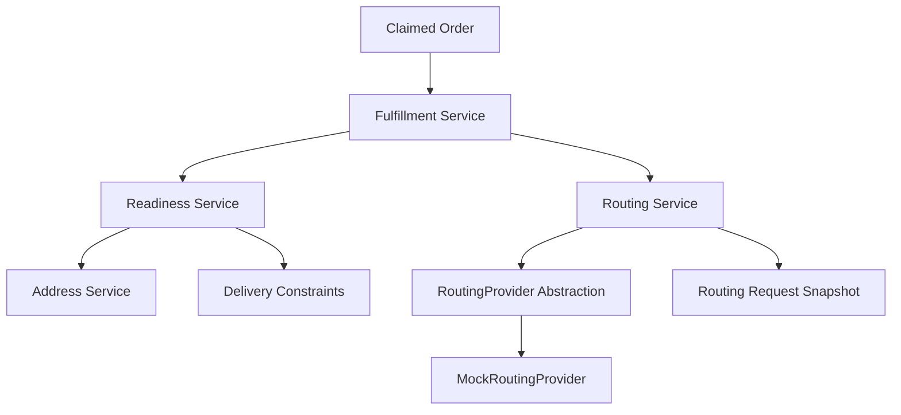

# Fulfillment & Routing Workflow Specification (Phase 8)

## 1. Architectural Overview

Phase 8 elevates ClaimRoute from customer intake and AI constraint extraction into a deterministic, backend-controlled fulfillment operations engine. It operationalizes claimed orders through structured state machines, transactional consistency, and an extensible routing provider abstraction.



---

## 2. Order, Fulfillment & Routing State Machines

ClaimRoute enforces strict, server-controlled state machines. Clients cannot mutate statuses arbitrarily.

### 2.1 Order Lifecycle

```text
CLAIMED ──> PROCESSING ──> ROUTING_READY ──> FULFILLMENT_READY ──> COMPLETED
   │             │
   └── CANCELLED └── CANCELLED
```

### 2.2 Transition Matrix

| Current Order Status | Allowed Next Statuses            | Prerequisites / Notes                                           |
| :------------------- | :------------------------------- | :-------------------------------------------------------------- |
| `CREATED`            | `CLAIM_PENDING`, `CANCELLED`     | Order created by sender                                         |
| `CLAIM_PENDING`      | `CLAIMED`, `CANCELLED`           | Recipient claim link active                                     |
| `CLAIMED`            | `PROCESSING`, `CANCELLED`        | Recipient completed claim, address confirmed                    |
| `PROCESSING`         | `ROUTING_READY`, `CANCELLED`     | Order under operational review; address & constraints validated |
| `ROUTING_READY`      | `FULFILLMENT_READY`, `CANCELLED` | Active routing request snapshot created                         |
| `FULFILLMENT_READY`  | `COMPLETED`                      | Dispatch handoff ready                                          |
| `COMPLETED`          | _(Terminal)_                     | Delivery finished                                               |
| `CANCELLED`          | _(Terminal)_                     | Order cancelled                                                 |

Any invalid transition attempt returns HTTP `409 Conflict` with error code `INVALID_WORKFLOW_TRANSITION`.

---

## 3. Data Models & Snapshot Strategy

### 3.1 Fulfillment Model (`fulfillments/{id}`)

The fulfillment document captures operational progression without duplicating the order:

| Field                 | Type           | Description                                                                 |
| :-------------------- | :------------- | :-------------------------------------------------------------------------- |
| `id`                  | `string`       | Unique document ID                                                          |
| `orderId`             | `string`       | Foreign key referencing `orders/{orderId}`                                  |
| `status`              | `string`       | `PENDING`, `PROCESSING`, `ROUTING_READY`, `READY`, `COMPLETED`, `CANCELLED` |
| `processingStartedAt` | `string (ISO)` | Timestamp when order moved to `PROCESSING`                                  |
| `routingReadyAt`      | `string (ISO)` | Timestamp when routing request was created                                  |
| `fulfillmentReadyAt`  | `string (ISO)` | Timestamp when order was marked fulfillment ready                           |
| `completedAt`         | `string (ISO)` | Timestamp when delivery was completed                                       |
| `createdAt`           | `string (ISO)` | Creation server timestamp                                                   |
| `updatedAt`           | `string (ISO)` | Last update server timestamp                                                |

### 3.2 Routing Request Model (`routingRequests/{id}`)

| Field                  | Nature        | Type           | Description                                                 |
| :--------------------- | :------------ | :------------- | :---------------------------------------------------------- |
| `id`                   | Identifier    | `string`       | Unique routing request ID                                   |
| `orderId`              | Reference     | `string`       | Reference to parent order                                   |
| `recipientId`          | Reference     | `string`       | Reference to recipient record                               |
| `status`               | State         | `string`       | `PENDING`, `READY`, `IN_PROGRESS`, `COMPLETED`, `CANCELLED` |
| `destination`          | **Snapshot**  | `object`       | `{ line1, line2, city, state, postalCode, country }`        |
| `deliveryWindow`       | **Snapshot**  | `object`       | `{ start, end }` from extracted constraints                 |
| `accessInstructions`   | **Snapshot**  | `string[]`     | Gate codes, parking, security notes                         |
| `dietaryConstraints`   | **Snapshot**  | `string[]`     | Dietary requirements if food delivery                       |
| `deliveryInstructions` | **Snapshot**  | `string[]`     | Contactless, specific doorstep placement                    |
| `source`               | Metadata      | `string`       | `"RECIPIENT_NOTES"` or `"SYSTEM"`                           |
| `mockRoute`            | Provider Plan | `object`       | Simulated route metadata, estimated duration                |
| `requestedAt`          | Timestamp     | `string (ISO)` | Timestamp when routing request was dispatched               |
| `readyAt`              | Timestamp     | `string (ISO)` | Timestamp when route plan was ready                         |
| `completedAt`          | Timestamp     | `string (ISO)` | Timestamp when routing finalized                            |

> [!NOTE]
> **Snapshot vs Reference Policy**: Destination address and delivery constraints are snapshotted in `routingRequests` at the moment of route calculation. This guarantees that dispatched operational routes remain immutable even if the recipient or order profile is modified subsequently.

---

## 4. Deterministic Readiness Rules

Routing readiness is calculated deterministically by `readinessService.js`. An LLM is **never** used to decide whether an order is eligible for routing.

### 4.1 Readiness Checklist

1. **Order Validity**: Order exists, has a valid item name, a positive quantity, and is not cancelled or completed.
2. **Claim Status**: Order is in `CLAIMED`, `PROCESSING`, or subsequent active operational state, with confirmed `claimedAt` and `recipientId`.
3. **Recipient Presence**: Recipient document exists in the `recipients` collection.
4. **Complete Address**: Validated by `AddressService` — `line1`, `city`, `state`, `postalCode`, and `country` must all be non-empty strings.
5. **Delivery Constraints Evaluation**:
   - `COMPLETED`: Constraints attached to snapshot.
   - `NO_NOTES`: Empty constraints attached; status flagged as `NO_NOTES`.
   - `FAILED`: Empty constraints attached; status flagged as `EXTRACTION_FAILED`. System **never fabricates** delivery constraints.

---

## 5. Routing Provider Abstraction

Phase 8 introduces the `RoutingProvider` abstract interface and a concrete `MockRoutingProvider`:

```javascript
class RoutingProvider {
  async createRoute(routingRequestSnapshot);
  async getRouteStatus(routeId);
}
```

### Mock Engine Guarantees:

- Marked clearly with `isMock: true` and `provider: "MOCK_ROUTING_PROVIDER"`.
- Does not pretend to navigate live GPS coordinates or call external mapping vendors.
- Allows seamless drop-in replacement with production providers (e.g. Mapbox, Google Maps, OpenRouteService) in future phases.

---

## 6. Operational REST APIs

All operational endpoints enforce sender authentication and data isolation boundaries:

| Method | Endpoint                                 | Description                                  | Idempotent |
| :----- | :--------------------------------------- | :------------------------------------------- | :--------- |
| `POST` | `/api/orders/:orderId/process`           | Transitions claimed order to `PROCESSING`    | Yes        |
| `GET`  | `/api/orders/:orderId/fulfillment`       | Retrieves fulfillment tracking record        | Yes        |
| `GET`  | `/api/orders/:orderId/readiness`         | Evaluates deterministic routing readiness    | Yes        |
| `POST` | `/api/orders/:orderId/routing-request`   | Creates routing request snapshot             | Yes        |
| `GET`  | `/api/orders/:orderId/routing-request`   | Retrieves active routing request             | Yes        |
| `POST` | `/api/orders/:orderId/fulfillment-ready` | Marks order as ready for fulfillment handoff | Yes        |
| `POST` | `/api/orders/:orderId/complete`          | Finalizes order fulfillment completion       | Yes        |
| `GET`  | `/api/orders/:orderId/operations`        | Consolidated operational view (PII filtered) | Yes        |

---

## 7. Security, Privacy & Failure Handling

1. **Authorization**: Orders are sender-scoped. Cross-sender operational calls are blocked with HTTP 403 `ForbiddenError`.
2. **PII Sanitization**: Response DTOs filter out token hashes, raw LLM prompts, recipient phone numbers, and database internal fields.
3. **Transactional Integrity**: Multi-document updates (Order + Fulfillment + Routing Request) execute within atomic Firestore transactions (`db.runTransaction`).
4. **Mass Assignment Protection**: Client request payloads attempting to modify `processingStartedAt`, `routingReadyAt`, `fulfillmentReadyAt`, or `completedAt` are rejected by validation middleware.
